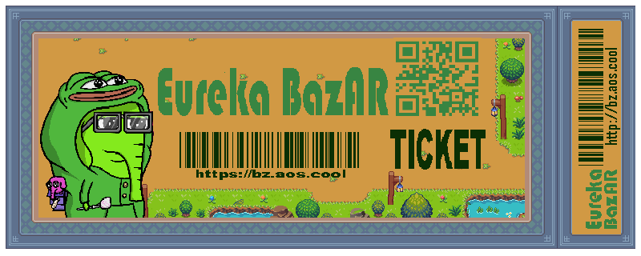

# Eureka BazAR
[English](./README.md) | [简体中文](./README.zh.md)

To experience the Eureka BazAR world, please visit https://bz.aos.cool/

This is a modern digital product marketplace created based on the AO Reality protocol. It features multiple interactive NPCs with whom you can interact using AO tokens and atomic assets. Upon entering the map, you will receive 200 EGC tokens, and you can claim EGC tokens every double-hour, daily, weekly, and monthly. These tokens can be used to purchase tickets and other atomic assets, as well as to participate in various EGC games.

Project Address: https://github.com/eurekachen/EurekaBazAR

## Loading Eureka BazAR
For instructions on how to load the Eureka BazAR world in AOS, see:  
[Loading Eureka BazAR Instructions](./World/world.md)

The Eureka BazAR world is created based on the Reality Protocol API. For details on the API protocol, see:  
[Reality Protocol v0.1](https://github.com/elliotsayes/Reality/blob/main/docs/Reality.md)

For specific methods on creating the world, see:  
[World Guide](https://github.com/elliotsayes/Reality/blob/main/docs/WorldGuide.md)

## Eureka BazAR Map
### BazAR Map Files:

### Casino Map Files:

### Ticket Files:

## Agent
For the Agent guide, see:  
[Agent Guide](https://github.com/elliotsayes/Reality/blob/main/docs/AgentGuide.md)

For methods to update the Agent, see:  
[agent.md](./Agent/agent.md) This is where the Agent template code is loaded in AOS.

The Agent is a concept in AOS; it is an entity that can think and act independently, also known as an intelligent agent. The project includes the following Agents:

- Banker.lua: Bank staff, queries token balance.
- Blackjack.lua: Blackjack dealer.
- Egc200Giver.lua: NPC that gives out 200 EGC tokens as a one-time gift.
- Hemera.lua: NPC that distributes daily EGC tokens.
- Helix.lua: NPC that distributes weekly EGC tokens.
- HourlyFaucet.lua: NPC that distributes hourly EGC tokens.
- LunarMan.lua: NPC that distributes monthly EGC tokens.
- Morpheus.lua: Character from "The Matrix."
- Profile.lua: NPC that assists in creating profiles.
- Septnary.lua: NPC that distributes weekly EGC tokens.
- Trader.lua: Merchant that can exchange Llama and EGC.

**This is a dynamically updated Agent:**
- ServiceGirl.lua: A walking waitress, you can call her to serve you.

## Sprite
[Sprite Files](./Sprite/)

Here are the Sprite files used in Eureka BazAR as well as the original files.
