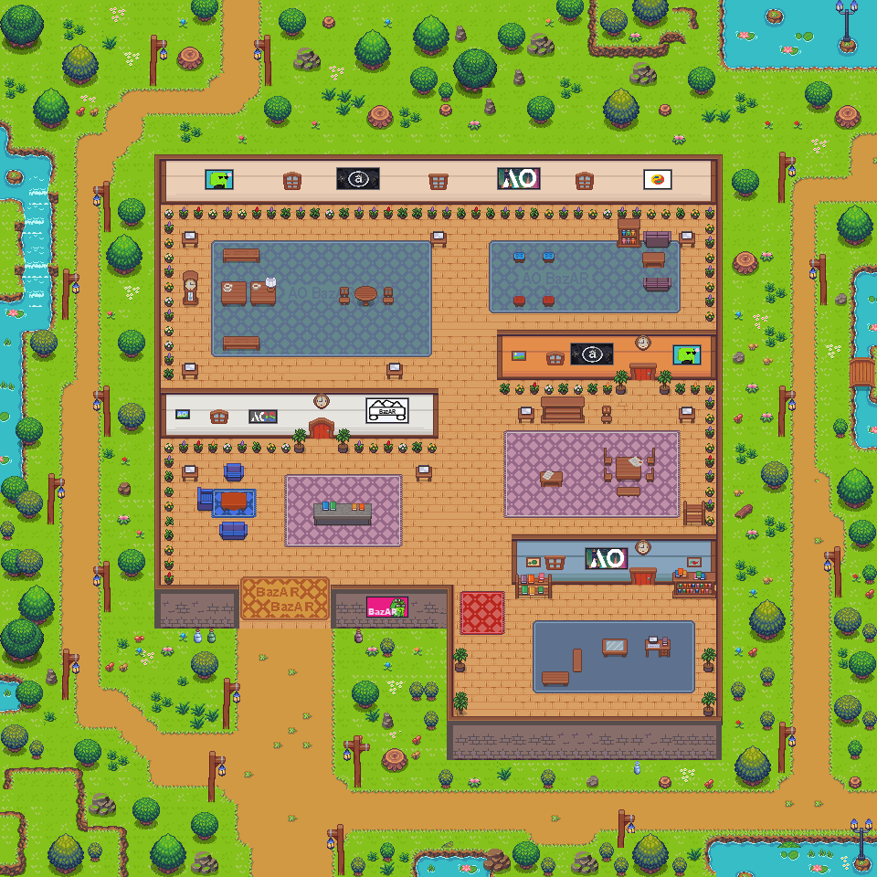
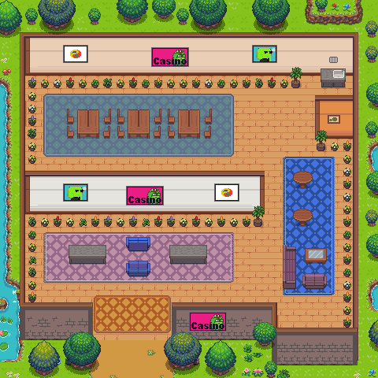
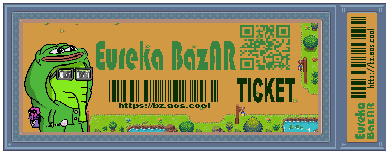

# 易易市场（Eureka BazAR）

体验该游戏，请访问 https://bz.aos.cool/

这是一个现代化的数字产品市场，它基于AO Reality协议创建，里面有多个可以交互的NPC，可在同AO代币和原子资产进行交互。进入地图即可领取200EGC代币，并且每2小时，每天，每周，每月，都可以领取EGC代币，用这些代币可以购买门票等原子资产以及参与各种EGC游戏。

项目地址：https://github.com/eurekachen/EurekaBazAR

## 加载Eureka BazAR
在AOS中如何加载Eureka BazAR世界参见：   
[加载Eureka BazAR说明](./World/world.md)

Eureka BazAR 世界是根据 Reality Protocol 的 API 创建的，API协议参见：
[Reality Protocol v0.1](https://github.com/elliotsayes/Reality/blob/main/docs/Reality.md)

创建世界的具体方法参见：
[World Guide](https://github.com/elliotsayes/Reality/blob/main/docs/WorldGuide.md)

## Eureka BazAR 地图
### BazAR地图的文件：

### 娱乐场地图文件：

### 门票文件：

## Agent
Agent指南参见：
[Agent Guide](https://github.com/elliotsayes/Reality/blob/main/docs/AgentGuide.md)

更新Agent的方法参见：
[agent.md](./Agent/agent.md) 这里是在AOS中加载Agent模板代码的地方。

Agent是AOS中的一个概念，它是一个可以独立思考和行动的实体，也叫智能体，项目中包括了以下Agent：

- Banker.lua：银行工作人员，查询代币余额。
- Blackjack.lua：21点发牌员
- Egc200Giver.lua：一次性赠送出200EGC的NPC
- Hemera.lua:每天领取EGC的NPC
- Helix.lua:每周领取EGC的NPC
- HourlyFaucet.lua:每小时领取EGC的NPC
- LunarMan.lua:每月领取EGC的NPC
- Morpheus.lua:《黑客帝国》里的人物
- Profile.lua:协助创建Profile的NPC
- Septnary.lua:每周领取EGC的NPC
- Trader.lua:商人，可以兑换Llama和EGC

**这是动态更新的Agent：**
- ServiceGirl.lua:在来回走动的服务生，你可以叫她为您服务

## Sprite
[精灵文件(./Sprite/)](./Sprite/)

这里有Eureka BazAR用到的Sprite文件以及原文件

